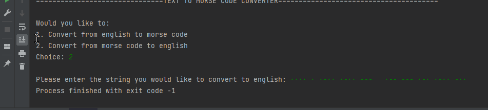

A text-based Python program to convert Strings into Morse Code.

# Table of Contents
- [Getting Started](#getting-started)
- [Solution Walkthrough](#solution-walkthrough)
- [API Usage](#api-usage)
  - [Introduction](#introduction)
  - [Setup](#setup)
  - [Sample Usage](#sample-usage)
    - [Python](#python)
      

# Getting Started
- Fork this repo and install all the requirements in the `requirements.txt` file
- Run the `main.py` file inside the `resources` folder.

##### OR
- Get your own local copy by cloning using the command below:
```commandline
git clone https://github.com/Josh-Ay/text-to-morse-code.git
``` 
- Install all the requirements in the `requirements.txt` file
- Run the `main.py` file inside the `resources` folder.

# Solution Walkthrough:


# API Usage
Read full API [docs](https://documenter.getpostman.com/view/16502009/UUy1fmyb).
## Introduction
Welcome to the free Morse API. A simple **local** API for converting english words or strings into morse code and back.

## Setup
- Navigate to the `resources/api/` folder 
- Run the `server.py` file.
- Make your requests to the running local server !


## Sample Usage
## Python
### Converting english text to morse code:

**Sample Post Request:** 
```python
import requests

ENDPOINT_URL = "localhost:5000/morse"

params={
  "q": "Hello world"
}

response = requests.post(ENDPOINT_URL, params=params)
response.raise_for_status()
print(response.text)
```

**Sample Response**:
```json
{
  "message": "success", 
  "contents": {"morse_equivalent": "···· · ·-·· ·-·· ---   ·-- --- ·-· ·-·· −·· ", "original_text": "Hello world"}
}
```

### Converting morse code to english text:

**Sample Post Request**:
```python
import requests

ENDPOINT_URL = "localhost:5000/morse/english"

params={
  "q": "···· · ·-·· ·-·· ---   ·-- --- ·-· ·-·· −··"
}

response = requests.post(ENDPOINT_URL, params=params)
response.raise_for_status()
print(response.text)
```

**Response:**
```json
{
  "message": "success", 
  "contents": {"english_equivalent": "Hello world", "morse_text": "···· · ·-·· ·-·· ---   ·-- --- ·-· ·-·· −·· "}
}
```